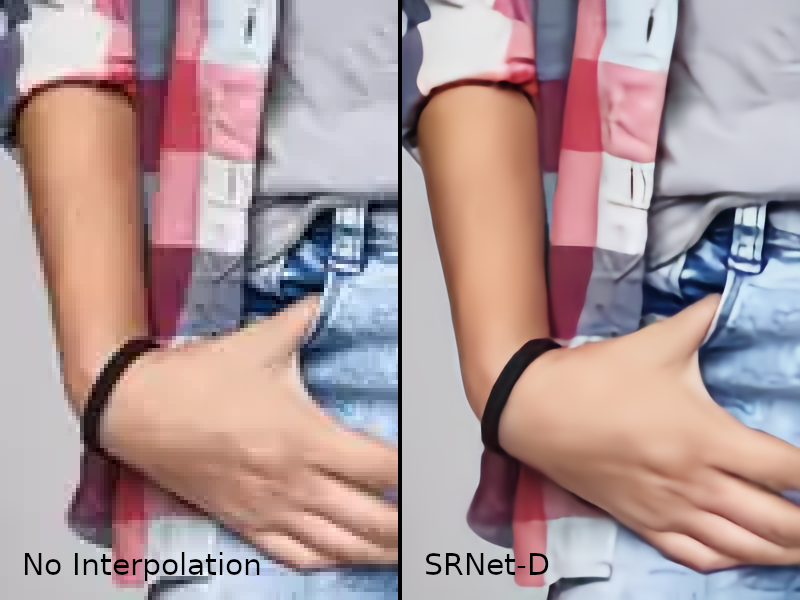
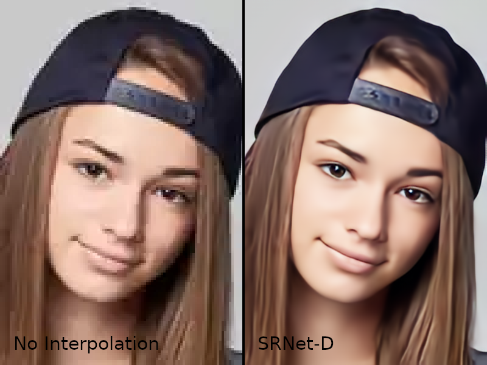

## Super-Resolution Network

- **Partially imported from [tensorlayer/srgan](https://github.com/tensorlayer/srgan).**
- **Using "Group Normalization" layers instead of "Batch Normalization" layers.**
- **Using "Residual of Residual Network".**
- **Using "Swish" activation function instead of "ReLU".**
- **Using MAE (Mean Absolute Error) loss and Sobel filter loss (high frequency loss).**
- **Image data augmentation with random size cropping at random position, and random hue rotation.**
- **Added compression noise removal capability by learning WebP image compression noise.**
- **You can read/write PNG/WebP/BMP/JPEG/TIFF files.**

### System Requirements
- **Memory: 10GB RAM**

## Preparation

We run this script under [TensorFlow](https://www.tensorflow.org) 1.13 and the [TensorLayer](https://github.com/tensorlayer/tensorlayer) 1.11.1.

1. Install TensorFlow.

1. Follow the instructions below to install other requirements.
```bash
cd ~/
sudo python3 -m pip install https://github.com/tensorlayer/tensorlayer/archive/1.11.1.zip
git clone https://github.com/ImpactCrater/SRNet-D.git
sudo python3 -m pip install easydict
sudo apt install python3-tk
sudo apt install webp

wget https://github.com/webmproject/libwebp/archive/v1.0.2.zip
unzip v1.0.2.zip
cd ./libwebp-1.0.2
./autogen.sh
./configure
make
sudo make install

sudo python3 -m pip uninstall pillow
python3.6 -m pip install -U --force-reinstall pillow-simd
```

### My Results

<div align="center">
	
</div>
</a>

<div align="center">
	
</div>
</a>

<div align="center">
	
</div>
</a>
Original image is from iStock.

### Prepare Data

 - You need to have the high resolution images for training and validation.
   -  You can set the path to your training image folder via `config.TRAIN.hr_img_path` in `config.py`.
   -  You can set the path to your validation image folder via `config.VALID.hr_img_path` in `config.py`.
   -  Subdirectories are searched recursively.

### You can use pre-trained model and re-train it.
 1. Under construction.

### Run

#### Start training.

```bash
python main.py
```

#### Start evaluation.
 - After training, if you want to test the model, You need to put images in the specified folder.
   -  You can set the path to your test images folder via `config.VALID.eval_img_path` in `config.py`.
  

```bash
python main.py --mode=evaluate 
```

#### Start enlargement.
 - After training, if you want to enlarge your images, You need to put images in the specified folder.
   -  You can set the path to your images folder via `config.VALID.enlargement_lr_img_path` in `config.py`.
  

```bash
python main.py --mode=enlarge 
```

### License

- For academic and non-commercial use only.
- For commercial use, please contact tensorlayer@gmail.com.
