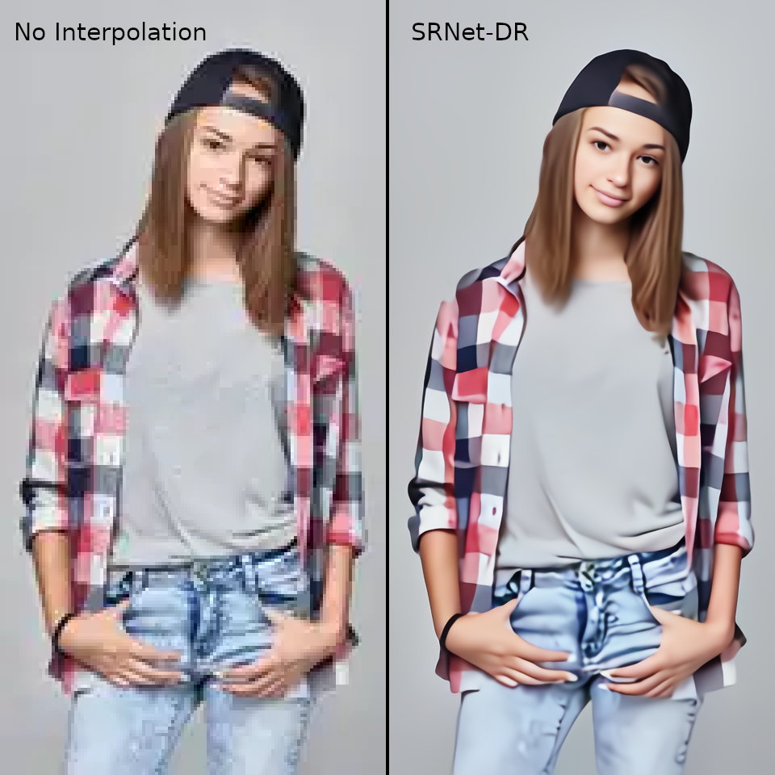
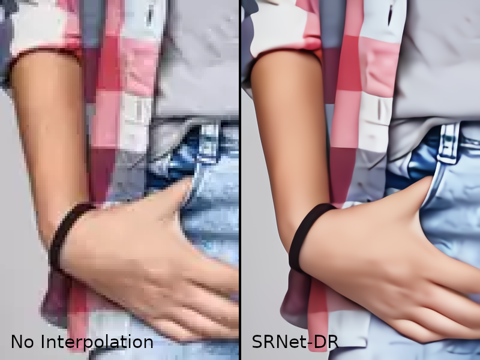
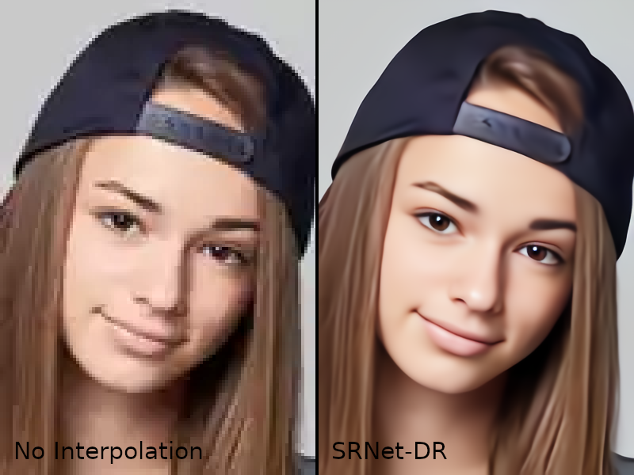

## Super-Resolution Network
- **Written in PyTorch.**
- **Using "Group Normalization" layers instead of "Batch Normalization" layers.**
- **Using "Residual of Residual Network".**
- **Using "Swish" activation function instead of "ReLU".**
- **Using log(1+(a\*(1-SSIM))^2) loss.**
- **Image data augmentation with random size cropping at random position, and random hue rotation.**
- **Auto-contrast and unsharp mask filter is applied to the training images.**
- **Added RGB noise removal capability by learning Gaussian noise.**
- **Added compression noise removal capability by learning WebP image compression noise.**
- **You can read/write PNG/WebP/BMP/JPEG/TIFF files.**
- **This project contains modified version of "[pytorch-ssim](https://github.com/Po-Hsun-Su/pytorch-ssim)" licensed under the MIT License.**
- **"class SwishFunction" is based on a part of the code in "https://github.com/ceshine/EfficientNet-PyTorch". It is licensed under the Apache License.**

### Required Memory
- **For training with CPU: 24GB+ RAM**
- **For training with GPU: 18GB+ VRAM**
- **For enlargement: 4GB+ RAM**

## Preparation

We run this script under [PyTorch](https://pytorch.org/) 1.8 or later.

1. Install PyTorch.

1. Follow the instructions below to install other requirements.
```bash
cd ~/
sudo pip install --upgrade pip
git clone https://github.com/ImpactCrater/SRNet-DR
sudo python3 -m pip install easydict
wget https://github.com/webmproject/libwebp/archive/v1.0.2.zip
unzip v1.0.2.zip
cd ./libwebp-1.0.2
./autogen.sh
./configure
make
sudo make install
sudo python3 -m pip uninstall pillow
sudo python3 -m pip install -U --force-reinstall pillow-simd
```

### My Results

<div align="center">
	
</div>
</a>

<div align="center">
	
</div>
</a>

<div align="center">
	
</div>
</a>
Original image is from iStock.

### Prepare Data

 - You need to have the high resolution images for training and validation.
   -  You can set the path to your training images folder via `config.trainingHRImagePath` in `config.py`.
   -  You can set the path to your validation images folder via `config.validationHRImagePath` in `config.py`.
   -  Subdirectories are searched recursively.

### Run

#### Start training.

```bash
python3 main.py
```

#### Start evaluation.
 - After training, if you want to test the model, You need to put images in the specified folder.
   -  You can set the path to your test images folder via `config.VALID.evaluationImagePath` in `config.py`.
  

```bash
python main.py --mode=evaluate 
```

#### Start enlargement.
 - After training, if you want to enlarge your images, You need to put images in the specified folder.
   -  You can set the path to your images folder via `config.VALID.enlargementLRImagePath` in `config.py`.
  

```bash
python main.py --mode=enlarge 
```

### License
[MIT License](https://github.com/ImpactCrater/SRNet-D/blob/master/LICENSE.txt)
